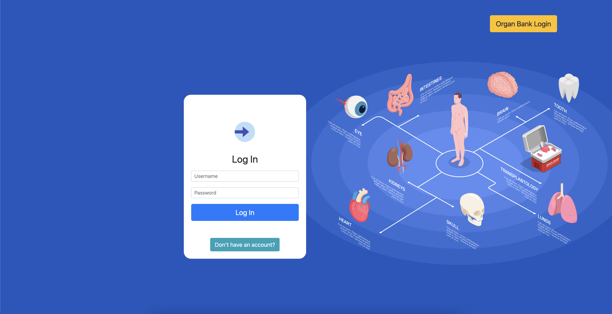

# e_Organ_Donor

I built this project to understand Django more deeply

## To Try this out you have to follow the steps: #
### I'm not sure about the mac commands so make sure you google anything if it doesn't work ###

* Clone the repository into a directory.
* Skip the tedious process and simply run using docker-compose
    * Make sure you have docker and docker-compose installed
    * Execute the command `docker-compose up`
    * Enter the address

If you want to run it without docker-compose follow the steps below
* You must have Python 3.8.5 or higher, but beware the packages might not work as intended if the version changes.
* To create the virtual Environment open you command-line:
  * Windows:
    `python -m venv 'env_name'`
  * Mac:
    `python3 source 'env_name'`
* Once the venv is created you must activate it and install the required packages.
* To activate it:
  * Windows:
    Execute the command `'env_name'\Scripts\activate`
  * Mac:
    Execute the command source `'env_name'/bin/activate`
#### (This is very important before you proceed. Make sure you activate) ####
* The requirements.txt is included in the repository so jus execute the command pip install -r requirements.txt
* You can also choose to install them one by one.
* Once the packages are installed now the only thing left is to run the application.
* Execute python manage.py runserver (Make sure you are in the directory with the file manage.py).
* Enter the address 127.0.0.1:8000 in your browser to view.

## If you want your own data in the database ##
You must delete the db.sqlite 3 and run migrations once again and before running migrations do delete the files inside migrations directory inside every directory in  the project
